# Explainable Vessel Re-identification

## Overview
This project introduces an explainable vessel re-identification system aimed at improving the interpretability of maritime vessel recognition systems. It utilizes a Vision Transformer (ViT) model, coupled with pairwise heatmap visualizations through Attention Flow Approximation as proposed in [1,4], as well as GradCam++ visualizations [2,5]. The ViT model achieves parity with traditional CNN architectures in performance, while offering more intuitive result interpretations and more effective explanations than conventional methods like GradCam.

**Model Architecture**:  The employed architecture is a ViT with 12 layers, 12 attention heads, 16x16 patches and 768-dimensional embeddings.

## Quantitative Results
The model is evaluated on two different test sets: 
- The first test set contains unseen images for vessels present in the training set.
- The second test set contains images of completely unseen vessels.

The table below summarizes the model's performance on both sets.

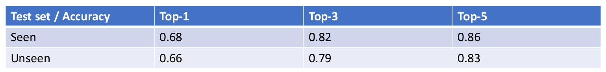

## Qualitative Results

Displayed below are pairwise heatmaps of selected vessel images alongside their top three model-retrieved counterparts. Correct matches are highlighted in green, while incorrect ones are marked in red.

### "Seen" Test Set
Examples of correctly retrieved images
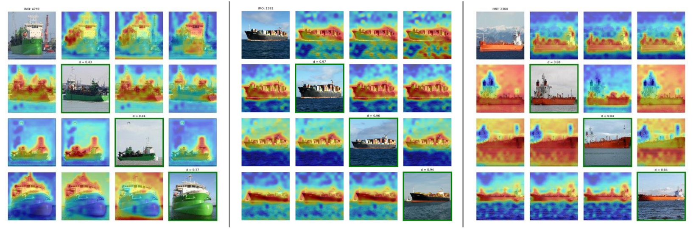
In the examples below, the model is focusing on the relevant parts, but the difference between the vessels is very subtle.
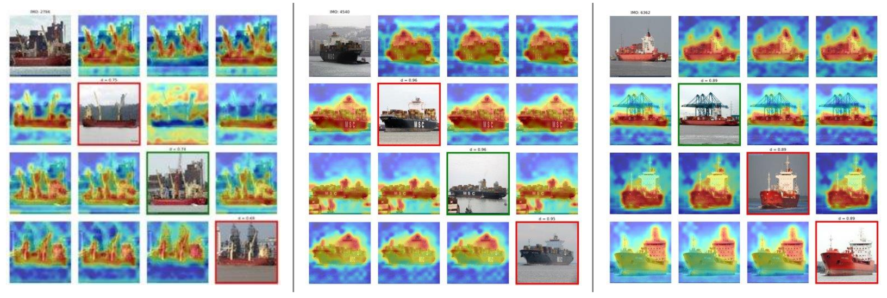
Again, the model is focusing on the most distinctive parts of the vessels.
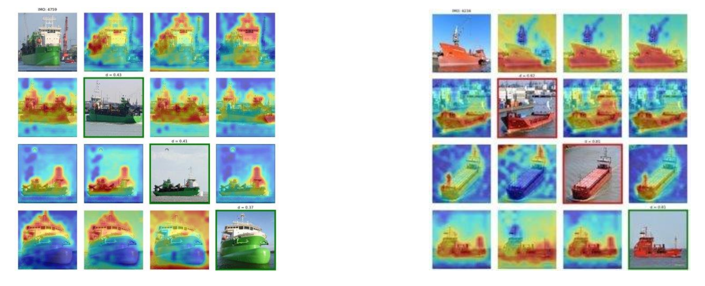
In some instances, the model is distracted by the background
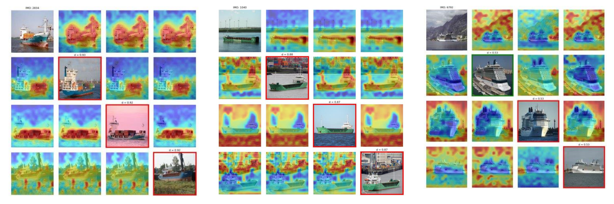
Here, the model is focusing on the containers instead of the vessel itself, which leads to wrong predictions.
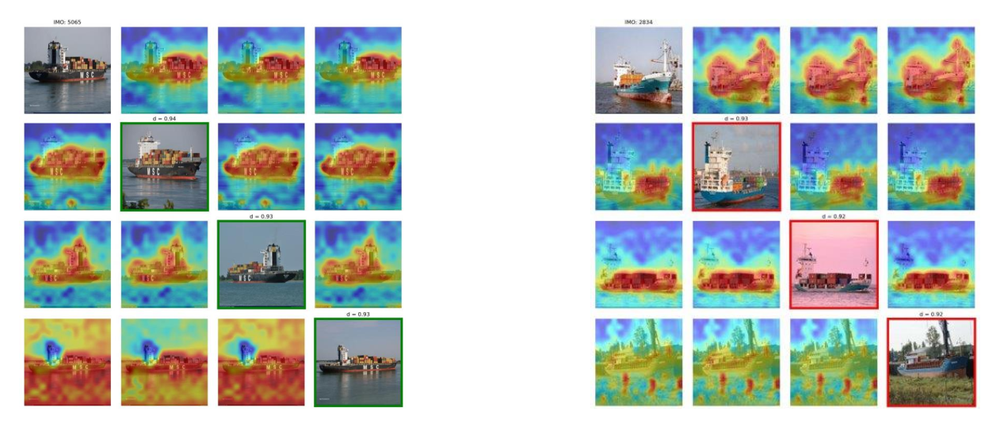

### "Unseen" Test Set

In the example below, the part on which the model focuses most is the ship's chimney.
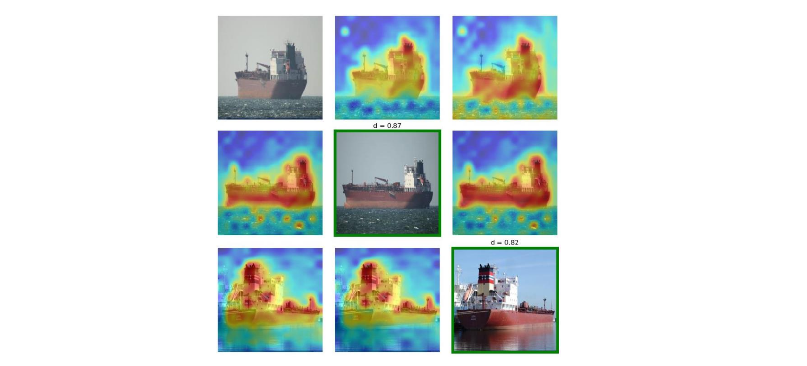
Below are some other examples in which the model is focusing on distinctive parts of the vessels.
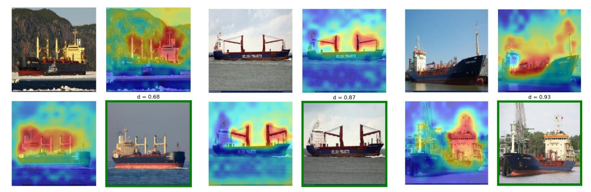
In the following examples, the model focuses on the relevant parts but fails due to the high resemblance between different vessels.
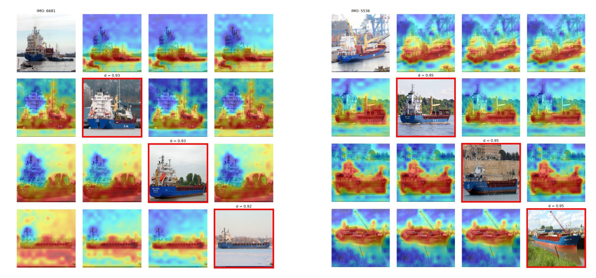
Again, the model can be distracted by the backround or the containers.
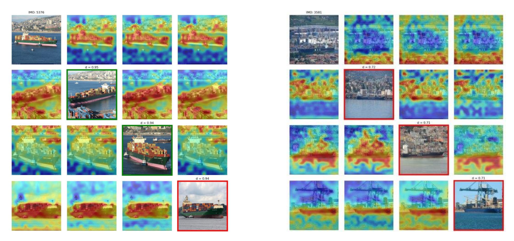

### Comparison with GradCam++
Below are some exmaples of the vizualizations output by GradCam++.

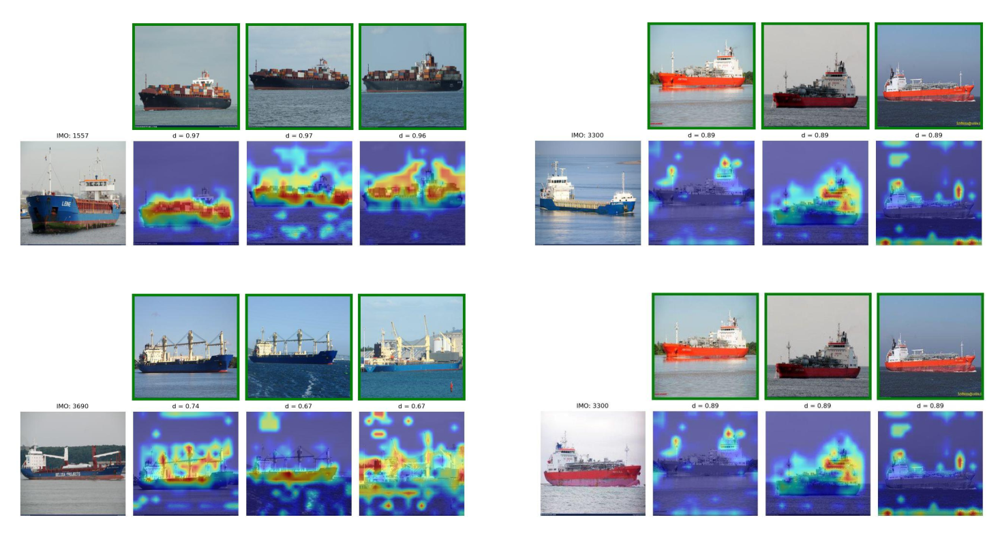
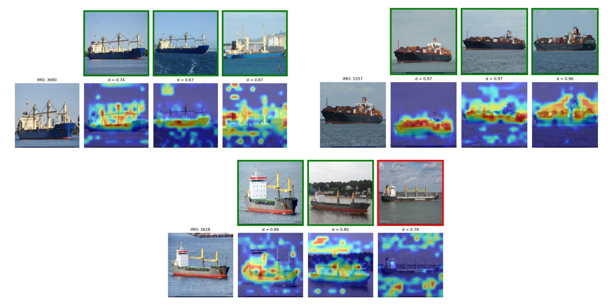

## References
- [1] Black, Samuel, et al. "Visualizing paired image similarity in transformer networks." Proceedings of the IEEE/CVF Winter Conference on Applications of Computer Vision. 2022.
- [2] Chattopadhay, Aditya, et al. "Grad-cam++: Generalized gradient-based visual explanations for deep convolutional networks." 2018 IEEE winter conference on applications of computer vision (WACV). IEEE, 2018.
- [3] Dosovitskiy, Alexey, et al. "An image is worth 16x16 words: Transformers for image recognition at scale." arXiv preprint arXiv:2010.11929 (2020).
- [4] https://github.com/vidarlab/xformer-paired-viz
- [5] https://github.com/jacobgil/pytorch-grad-cam
- [6] Douze, Matthijs, et al. "The faiss library." arXiv preprint arXiv:2401.08281 (2024).
- [7] https://github.com/Lightning-AI/pytorch-lightning